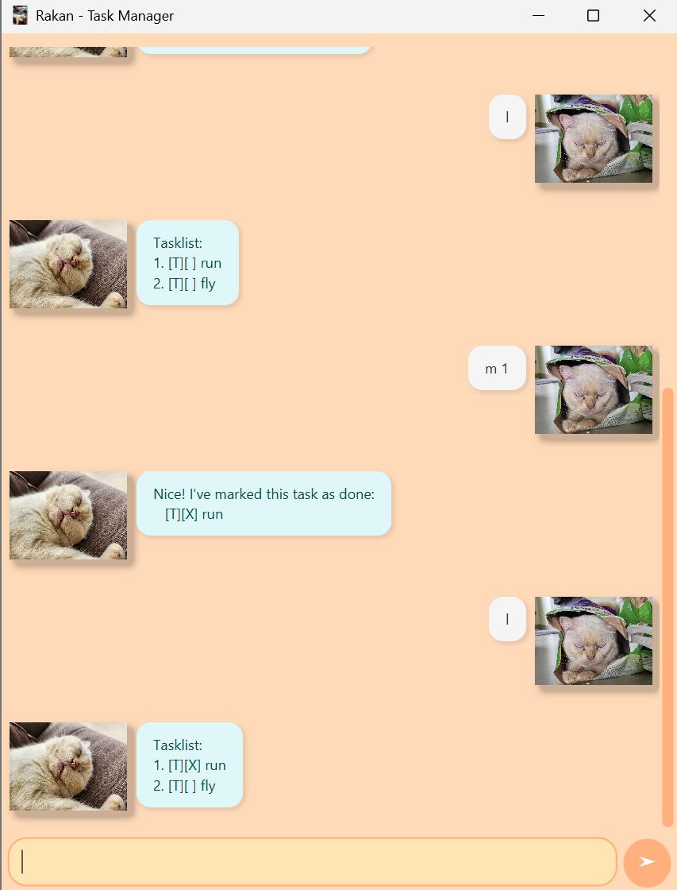

# Rakan User Guide

Rakan is a desktop app for managing tasks using an intuitive CLI, and gorgeous GUI.

## Quick Start

1. Make sure you have at least Java 17 on your computer.
2. Download the latest .jar release here
3. Open the program and get started!

## Features

There are 3 types of tasks the user can deal with in Rakan:
* Todos
* Deadlines
* Events

The user inputs commands to Rakan fully through the CLI.
The commands can be either typed in full form or short form, for convenience.

When typing in date times, the following format (dd/mm/yyyy hhmm) must be used.
E.g: "31/12/2020 1900"

Here are the list of commands to help you:

---

### Listing tasks - "list" / "l"

Lets the user view all their existing tasks in a list.
Takes no arguments.

Example: `list`

---

### Creating Todo tasks - "todo" / "t" + (description)

Lets the user create a todo task with only a description.

Example: `t read book`

---

### Creating Deadline tasks - "deadline" / "d" + (description) + "/by" + (date/time)

Lets the user create a task with a deadline.

Example: `d submit assignment /by 15/09/2025 2359`

---

### Creating Event tasks - "event" / "e" + (description) + "/from" + (date/time) + "/to" + (date/time)

Lets the user create an event with specific starting and ending time.

Example: `event CS2103T meeting /at 16/09/2025 1400`

---

### Marking tasks as done - "mark" / "m" + (index)

Marks a task as completed, using its index in the list.

Example: `m 2`

---

### Unmarking tasks - "unmark" / "u" + (index)

Reverts a completed task back to "not done".

Example: `u 2`

---

### Deleting tasks - "delete" / "del" + (index)

Deletes the task at the given index from the list.

Example: `delete 3`

---

### Finding tasks - "find" / "f" + (keyword)

Searches for tasks that contain the given keyword in their description.

Example: `f book`

---

### Exiting the app - "bye" / "b"

Exits the application.

Example: `bye`

---

## Saving the Data

Rakan automatically saves your tasks to the hard disk after any command.  
Your data will be stored in `./data/rakan.txt` by default, and will be loaded each time you run the app.

---

## GUI Overview

- The **CLI box** at the bottom is where you type your commands.
- The **button** is used to submit commands to Rakan.
- The **dialog area** shows the conversation with Rakan.
- The conversation can be scrolled through via the **scrollbar** on the right.

---

## Command Summary

| Command       | Short Form | Format Example                                                  |
|---------------|-----------|-----------------------------------------------------------------|
| list          | l         | `list`                                                          |
| todo          | t         | `todo read book`                                                |
| deadline      | d         | `d submit assignment /by 15/09/2025 2359`                       |
| event         | e         | `event project meeting /from 16/09/2025 1400 /to 16/092025 1600` |
| mark          | m         | `m 2`                                                           |
| unmark        | u         | `u 2`                                                           |
| delete        | del       | `delete 3`                                                      |
| find          | f         | `find book`                                                     |
| bye           | b         | `bye`                                                           |

---

### Feedback

For any issues, email me at harunabdullah003@gmail.com, or message me on telegram at @h_a_v_w_d
